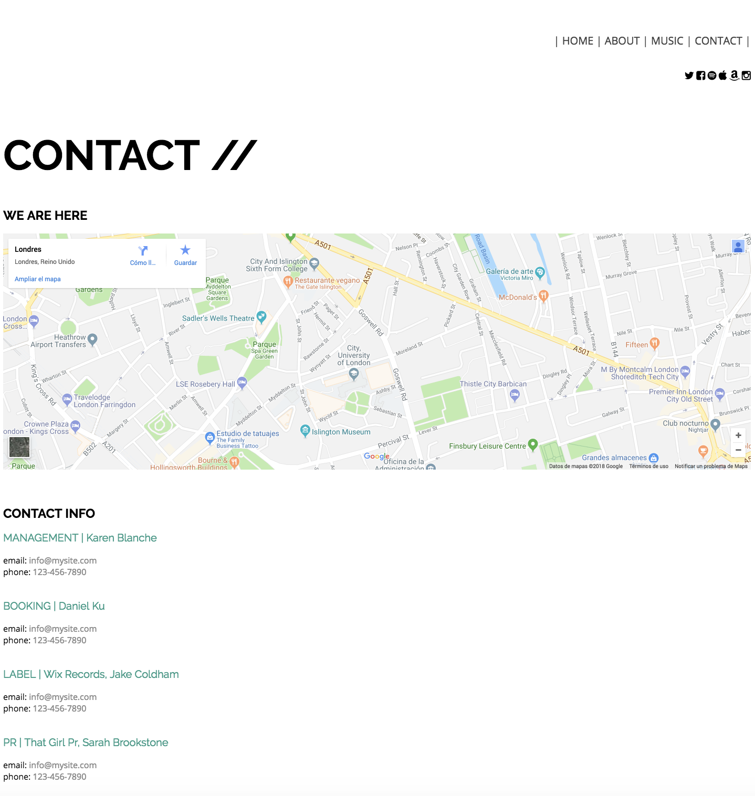

# Responsive single musical page: "Emilia Cole"

Para que podás trabajar con estos archivos lo primero será:

1. Descargá estos archivos a traves de este comando (en tu terminal): " https://github.com./nelsonbarrios/emilia-cole.git "
2. Ingresar a la carpeta: `cd emiliacole`.
3. Una vez dentro, ejecutar: `npm install`.
4. Terminada la instalación. Ejecutar `npm start`. Ahora ya podés acceder a [localhost:3000](http://localhost:3000)

Maquetado para Desktop

### Mock-ups

◾️ Home

◽️ About

◾️ Music

◽️ Contact

